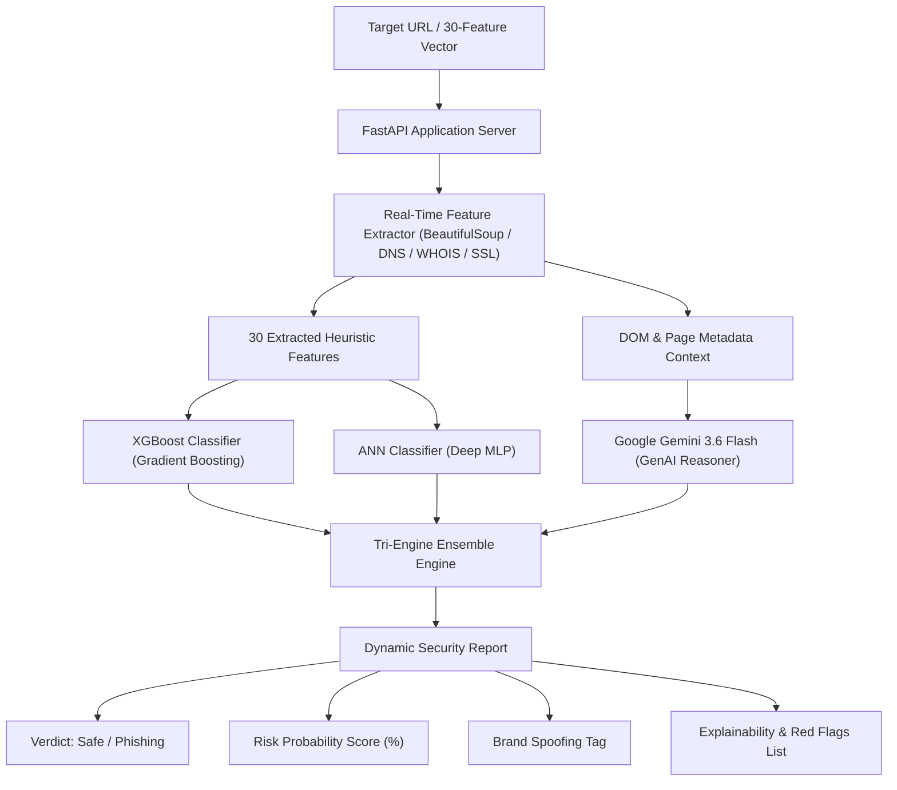

<div align="center">

# 🛡️ PhishGuard AI
### Hybrid Multi-Engine Phishing Detection & Threat Intelligence Platform

[](https://www.python.org/)
[](https://fastapi.tiangolo.com/)
[](https://xgboost.readthedocs.io/)
[](https://ai.google.dev/)
[](https://github.com/astral-sh/uv)
[](LICENSE)

<p align="center">
  <b>An enterprise-grade, multi-paradigm cybersecurity platform combining tabular Machine Learning (XGBoost & Deep ANN) with Generative AI (Google Gemini 3.6 Flash) for real-time phishing website detection, brand spoofing audit, and threat explainability.</b>
</p>

[Key Features](#-key-features) • [Architecture](#-architecture) • [30-Feature Matrix](#-30-feature-engineering-matrix) • [Tech Stack](#-tech-stack) • [Quick Start](#-quick-start) • [API Reference](#-api-reference)

---

</div>

## 📌 Overview

Traditional phishing detectors rely either exclusively on **static blocklists** (which fail against zero-day phishing kits) or **black-box machine learning** (which lacks actionable explainability for security analysts).

**PhishGuard AI** solves this by unifying **three detection paradigms** into a single cohesive platform:
1. **Ultra-Fast Tabular Machine Learning**: Evaluates 30 lexical, SSL, domain trust, and client-side DOM vectors via **XGBoost** and **Multi-Layer Perceptron (ANN)** in $< 5\text{ms}$.
2. **Generative AI Threat Reasoning**: Leverages **Google Gemini 3.6 Flash** to perform semantic domain audits, identify targeted brand impersonation (e.g. PayPal, Microsoft, Google), and synthesize human-readable explainability reports.
3. **Tri-Engine Hybrid Consensus**: Blends tabular ML confidence with LLM reasoning via a weighted ensemble:
   $$\text{Ensemble Risk} = 40\%(\text{XGBoost}) + 20\%(\text{ANN}) + 40\%(\text{Gemini})$$

---

## ✨ Key Features

- **🚀 3 Distinct Operational Modes**:
  - **Mode 1 (Tabular ML)**: Interactive 30-feature heuristic control panel with pre-built benign/phishing presets and live URL auto-extraction.
  - **Mode 2 (Google Gemini GenAI)**: Zero-shot semantic threat audit detecting typosquatting, deceptive subdomains, and credential traps.
  - **Mode 3 (Tri-Engine Hybrid Ensemble)**: Multi-model consensus with comparative sub-model scoring.
- **🔍 30 Real-Time Feature Extractors**: Automated extraction of DNS records, SSL/TLS handshake validity, WHOIS domain age, form action protocols, iframe traps, and external anchor ratios.
- **🏷️ Automated Brand Spoofing Identification**: Instantly flags impersonation of major financial and tech institutions (*PayPal, Microsoft 365, Google, Apple, Bank of America, Netflix*).
- **📊 Actionable Threat Intelligence Reports**: Every scan produces an executive summary, quantified risk percentage bar, key security red flags, and context-aware end-user recommendations.
- **⚡ Modern High-Tech UI**: Dark-mode glassmorphic dashboard built with vanilla responsive CSS, Google Inter & JetBrains Mono typography, animated risk gauges, and asynchronous status indicators.
- **📦 Production-Ready Python Tooling**: Managed via `uv` with pinned Python 3.11.13 and full OpenAPI / Swagger documentation.

---

## 🏛️ Architecture



---

## 🔬 30-Feature Engineering Matrix

The tabular models (**XGBoost** and **ANN**) are trained on the standard UCI Phishing Dataset (`data/phishing.csv`), capturing 30 comprehensive threat dimensions:

| Category | Features | Description |
|---|---|---|
| **🔐 URL Structure & Lexical** (7) | `having_IP_Address`<br>`URL_Length`<br>`Shortining_Service`<br>`having_At_Symbol`<br>`double_slash_redirecting`<br>`Prefix_Suffix`<br>`having_Sub_Domain` | Detects raw IP hostnames, character count inflation, URL shortener redirects, `@` credential masking, multi-level subdomains, and hyphenated typosquatting. |
| **🔒 Security & SSL Protocols** (5) | `SSLfinal_State`<br>`HTTPS_token`<br>`port`<br>`DNSRecord`<br>`Favicon` | Validates TLS/SSL certificate trust chains, non-standard open ports, DNS `A` record resolution, and external favicon origin. |
| **🌐 Domain Trust & Reputation** (7) | `Domain_registeration_length`<br>`age_of_domain`<br>`Google_Index`<br>`Page_Rank`<br>`web_traffic`<br>`Links_pointing_to_page`<br>`Statistical_report` | Inspects WHOIS domain registration tenure, domain age ($< 6$ months), search engine indexing status, Alexa traffic rank, and external backlink volume. |
| **🚨 Webpage DOM & Client Behavior** (11) | `Request_URL`<br>`URL_of_Anchor`<br>`Links_in_tags`<br>`SFH`<br>`Submitting_to_email`<br>`Abnormal_URL`<br>`Redirect`<br>`on_mouseover`<br>`RightClick`<br>`popUpWidnow`<br>`Iframe` | Audits external asset request ratios, suspicious form handlers (`mailto:` or external domains), right-click tampering, mouseover status bar deception, and hidden `<iframe>` overlays. |

---

## 🛠️ Tech Stack

- **Backend Framework**: [FastAPI](https://fastapi.tiangolo.com/) (ASGI) + [Uvicorn](https://www.uvicorn.org/)
- **Machine Learning**: [XGBoost](https://xgboost.readthedocs.io/), [Scikit-Learn](https://scikit-learn.org/) (MLPClassifier, StandardScaler), [Joblib](https://joblib.readthedocs.io/)
- **Generative AI**: [Google GenAI SDK](https://github.com/googleapis/python-genai) (`gemini-3.6-flash`), [Pydantic V2](https://docs.pydantic.dev/)
- **Feature Extraction**: `BeautifulSoup4`, `python-whois`, `dnspython`, `requests`, `urllib3`
- **Environment & Dependency Management**: [Astral uv](https://github.com/astral-sh/uv) (Python 3.11.13)
- **Frontend / UI**: HTML5, Jinja2 Templates, Modern CSS (Glassmorphism, CSS Grid, Flexbox)

---

## 🚀 Quick Start

### 1. Prerequisites
- **Python 3.11.13** (or installed automatically via `uv`)
- **uv** package manager installed:
  ```bash
  # Windows (PowerShell)
  powershell -ExecutionPolicy ByPass -c "irm https://astral.sh/uv/install.ps1 | iex"

  # macOS / Linux
  curl -LsSf https://astral.sh/uv/install.sh | sh
  ```

### 2. Clone and Setup Environment
```bash
git clone https://github.com/your-username/phishing-website-detection.git
cd phishing-website-detection

# Sync dependencies and build virtual environment
uv sync
```

### 3. Configure Gemini API Key
Create a `.env` file in the root directory:
```env
# Obtain your key from https://aistudio.google.com/
GEMINI_API_KEY=your_actual_gemini_api_key_here
GEMINI_MODEL=gemini-3.6-flash
```
*(You can copy from the provided `.env.example` file)*

### 4. Train Models (Optional if artifacts exist)
If you wish to re-train the XGBoost and ANN models from the dataset:
```bash
uv run python run_pipeline.py
```

### 5. Launch the Web Application
```bash
uv run uvicorn api.main:app --reload --host 127.0.0.1 --port 8000
```
Open your browser and navigate to **`http://127.0.0.1:8000`**.

---

## 📖 API Reference

FastAPI automatically generates interactive Swagger and ReDoc documentation:
- **Swagger UI**: `http://127.0.0.1:8000/docs`
- **ReDoc**: `http://127.0.0.1:8000/redoc`

### Endpoints Overview

| Method | Endpoint | Description | Payload |
|---|---|---|---|
| `GET` | `/` | Renders the primary cybersecurity multi-mode dashboard. | None |
| `POST` | `/predict` | Executes prediction across selected mode (`xgboost`, `ann`, `gemini`, `ensemble`). | `url`, `model_type`, optional 30 feature fields |
| `POST` | `/extract_features` | Extracts 30 numerical/categorical features from a target URL in real time. | `{"url": "https://example.com"}` |

---

## 📂 Project Structure

```
PHISHING WEBSITE DETECTION/
├── .env.example                  # Template for API keys
├── .python-version               # Pinned Python version (3.11.13)
├── config.yaml                   # Global model hyperparameters & artifact paths
├── pyproject.toml                # uv project configuration & dependency locks
├── requirements.txt              # Standard pip requirements fallback
├── run_pipeline.py               # End-to-end training pipeline orchestrator
│
├── api/                          # Web Server & Interface
│   ├── main.py                   # FastAPI application routes & controller
│   └── templates/
│       └── index.html            # Modern Dark Glassmorphic UI Dashboard
│
├── artifacts/                    # Serialized Model Binaries
│   ├── ann_mlp_model.pkl         # Trained Scikit-Learn MLP Neural Network
│   ├── scaler.pkl                # Fitted StandardScaler feature pipeline
│   └── xgb_model.pkl             # Trained XGBoost Classifier model
│
├── data/                         # Datasets
│   └── phishing.csv              # 11,055 samples with 30 security features
│
├── inference/                    # Inference & Engine Dispatcher
│   └── predictor.py              # Multi-model prediction router & ensemble math
│
├── notebook/                     # Exploratory Data Analysis (EDA)
│   └── EDA.ipynb                 # Feature correlations & model benchmarking
│
└── src/                          # Core Modules
    ├── config_loader.py          # YAML configuration parser
    ├── data_loader.py            # Dataset ingestion & validation
    ├── genai_detector.py         # Google Gemini 3.6 Flash reasoner module
    ├── pipeline.py               # Automated ML training workflow
    ├── preprocessor.py           # Feature transformations & scaling
    ├── train_ann.py              # Multi-Layer Perceptron trainer
    ├── train_xgboost.py          # XGBoost classifier trainer
    ├── utils.py                  # Helper functions & metric loggers
    └── website_feature_extraction.py # Real-time lexical/DOM/SSL scraper
```

---

## 🛡️ Evaluation & Model Benchmark

| Model Architecture | Training Objective | Inference Latency | Strengths |
|---|---|---|---|
| **XGBoost Classifier** | Gradient Boosted Decision Trees | $< 2\text{ms}$ | High precision on tabular patterns, resilient to feature sparsity. |
| **ANN (Deep MLP)** | 3-Layer Dense Network `[128, 64, 32]` | $< 5\text{ms}$ | Captures non-linear feature interactions and high-dimensional manifolds. |
| **Google Gemini 3.6 Flash** | Large Multimodal LLM Reasoning | $\sim 800\text{ms}$ | Zero-day brand spoofing detection, semantic NLP reasoning, clear explainability. |
| **Tri-Engine Ensemble** | Weighted Multi-Paradigm Fusion | $\sim 800\text{ms}$ | Highest resilience; combines quantitative feature rigor with qualitative semantic intelligence. |

---

## 🔒 Security & Ethical Disclaimer

This software is developed strictly for **educational, defensive, and academic research purposes** to enhance cybersecurity posture against fraudulent websites. Users are responsible for ensuring compliance with local laws and terms of service when querying third-party web domains.

---

## 📄 License

Distributed under the **MIT License**. See `LICENSE` for more details.
